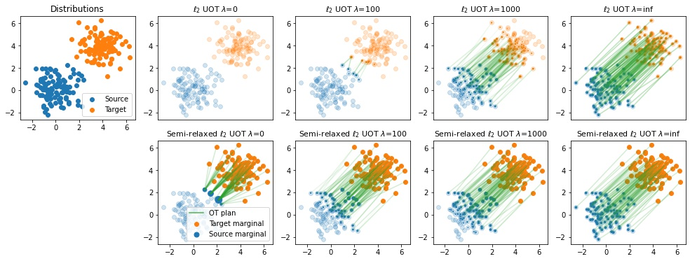

# Unbalanced Optimal Transport through Non-negative Penalized Linear Regression
Contains the code relative to the paper Unbalanced Optimal Transport through Non-negative Penalized Linear Regression https://arxiv.org/abs/2106.04145


## Requirements

To install requirements:

```setup
pip install -r requirements.txt
```

## Running

The regularization path algorithm is implemented in the [Python Optimal Transport (POT)](https://pythonot.github.io/) toolbox  and is the latest version up-to-date.

The functions for running the algorithms can be found in the following files:
- ``solvers\solver_kl_UOT.py`` contains the functions that allows solving the KL-penalized OUT, that is
	- ``ot_ukl_solve_BFGS`` to run the BFGS algorithm 
	- ``ot_uklreg_solve_mm`` to run our multiplicative algorithm 
- ``solvers\solvers_L2_UOT.py`` contains the functions that allows solving the L2-penalized OUT, that is
	- ``ot_ul2_solve_BFGS`` to run the BFGS algorithm 
	- ``ot_ul2_reg_path`` to compute our regularization path
	- ``ot_ul2_solve_lasso_celer`` to solve the UOT reformulated as a Lasso problem using the Celer implementation
	- ``ot_ul2_solve_lasso_cd`` to solve the UOT reformulated as a Lasso problem using the Scikit-learn implementation
	- ``ot_ul2_solve_mu`` to run our multiplicative algorithm 
- ``solvers\solver_semirelax_L2_UOT.py`` contains the functions that allows solving the semi-relaxed L2-penalized OUT, that is
	- ``ot_semi_relaxed_ul2_reg_path`` to solve our regularization path algorithm

## Results

Our results given in Figure 1, 2, 3 and 4 can be reproduced by running the following notebooks:

- Figure 1 can be reproduced by running the notebook [Figure 1.ipynb](Figure 1.ipynb)

 

- Figure 2 can be reproduced by running the notebook [Figure 2.ipynb](Figure 2.ipynb)

 

- Figure 3 can be reproduced by running the notebook [Figure 3.ipynb](Figure3.ipynb)

 

- Figure 4 can be reproduced by running the notebook [Figure 4.ipynb](Figure 4.ipynb)

 
